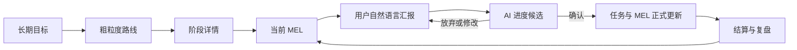

# PersonOS

PersonOS 是一款本地优先的 Windows 桌面学习与行动规划工具。它把长期目标转化为粗粒度学习路线、可执行的短周期 MEL（Minimum Executable Loop），并允许用户通过自然语言向 AI 汇报实际进展。

> 当前产品版本：**PersonOS v1.00（更智能）**
>
> 发布定位：完成版源码基线。数据模型、迁移和测试体系已建立；安装包与长期兼容承诺仍需在正式 Release 阶段单独验证。

## 产品原则

- **面向结果**：路线围绕“能够完成什么”，不为理论完整性堆叠无用课程。
- **用户最终确认**：AI 生成路线、阶段详情和进度更新候选，正式数据只在用户确认后改变。
- **本地优先**：核心数据保存在本机 SQLite；模型请求由客户端直连用户配置的兼容 API。
- **可追溯**：知识快照、AI 任务、候选决策、状态转移和进度事件均保留审计依据。
- **领域无关**：核心层不写死学科、课程、平台、模型或固定学习周期。

## 核心流程



## 已实现能力

- 长期目标、路线版本、阶段依赖图和阶段详情。
- MEL 生成、确认、激活、暂停、进度确认、结算与复盘状态机。
- AI 助手、OpenAI-compatible 模型连接和 Windows Credential Manager 密钥存储。
- 本地知识库、全文检索、可选本地嵌入、证据与知识快照。
- 自然语言进度汇报：AI 推断逐任务进度、耗时和下一步，用户确认后事务写入。
- 提醒规则、应用内通知、备份恢复、审计和数据迁移。
- 单元测试、仓储测试、迁移测试、QML smoke test 与端到端流程测试。

## 技术栈

- C++20
- Qt 6.10+（开发环境使用 Qt 6.11.2）
- QML / Qt Quick
- SQLite
- CMake 3.16+
- Windows 11 / MinGW 64-bit（当前主要支持环境）

## 快速开始

### 前置条件

1. 安装 Qt 6.10 或更高版本，并包含 `Quick`、`Sql`、`Network`、`Test` 组件。
2. 安装与 Qt 套件匹配的 MinGW 64-bit 和 CMake。
3. 将 Qt 与 MinGW 的 `bin` 目录加入当前终端的 `PATH`。

### 构建

```powershell
cmake -S . -B build -G "MinGW Makefiles" `
  -DCMAKE_PREFIX_PATH="D:\QT\6.11.2\mingw_64"
cmake --build build --parallel 1
```

### 测试

```powershell
Set-Location build
ctest --output-on-failure
$env:QT_QPA_PLATFORM='offscreen'
.\appPersonOS.exe --ui-check
```

### 运行

```powershell
.\appPersonOS.exe
```

首次启动会在用户本地应用数据目录创建 SQLite 数据库并执行迁移。模型连接需要在应用设置页中由用户主动配置和测试。

详细说明见 [构建与测试](docs/BUILDING.md)。

## 项目结构

```text
qml/                         QML 页面与可复用组件
resources/                   领域清单等只读资源
src/domain/                  领域实体与状态机
src/application/             用例、端口、契约与审计
src/infrastructure/          SQLite、AI、检索、备份等适配器
src/presentation/viewmodels/ QML ViewModel 与组合根
tests/                       自动化测试
tools/                       开发者工具
docs/                        面向贡献者的稳定文档
```

架构说明见 [ARCHITECTURE.md](docs/ARCHITECTURE.md)。

## 数据与隐私

- 数据库默认位于 Qt `AppLocalDataLocation` 下的 `personos.db`。
- API 密钥写入 Windows Credential Manager，不应写入仓库、日志或截图。
- 只有用户触发 AI 功能时，必要上下文才会发送到用户配置的第三方模型服务。
- 上传或分享仓库前，请确认没有数据库、备份、日志、模型文件和凭据。

详见 [PRIVACY.md](docs/PRIVACY.md) 与 [SECURITY.md](SECURITY.md)。

## 文档

- [文档索引](docs/README.md)
- [架构概览](docs/ARCHITECTURE.md)
- [构建与测试](docs/BUILDING.md)
- [隐私与数据边界](docs/PRIVACY.md)
- [贡献指南](CONTRIBUTING.md)
- [安全策略](SECURITY.md)
- [变更记录](CHANGELOG.md)

## 许可证

本仓库当前尚未声明开源许可证。在许可证文件发布前，默认保留所有权利；请勿假定代码可被复制、分发或用于商业用途。
